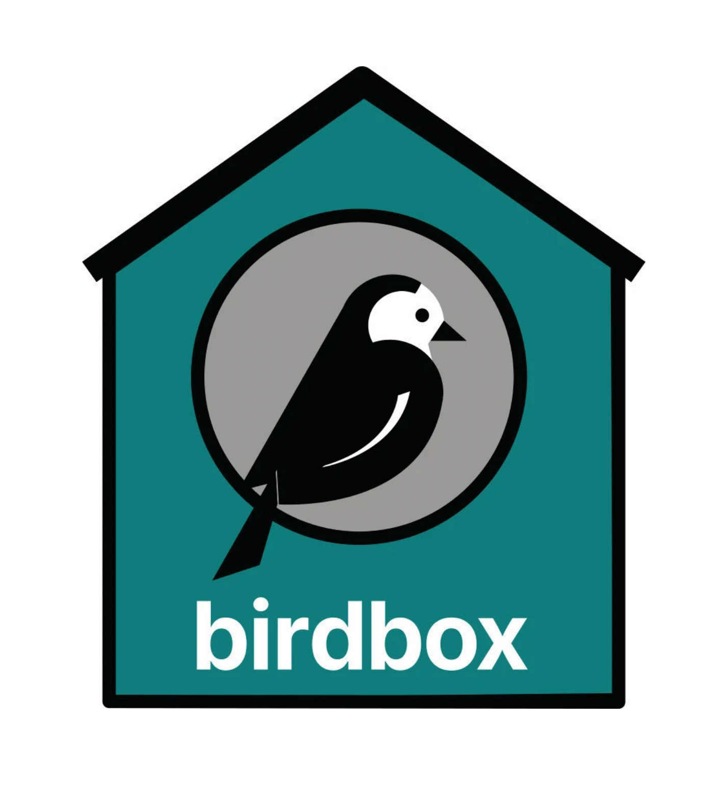

# Documentation for Project Birdbox

Birdbox is a kit for building on-brand, easily editable microsites quickly.

**This is a documentation-only repo. The codebase for the kit is at <https://github.com/mozmeao/birdbox/>**

Birdbox was developed by the Marketing Engineering team to save us time and to put more control over content in the hands of the relevant project’s teams.

It is a full-stack solution, bringing together three key aspects:

* Wagtail: a class-leading content management system: Wagtail

* [Protocol](https://protocol.mozilla.org), Mozila’s design system for the web, to help ensure the sites look and behave like Mozilla sites

* Streamlined infrastructure setup.

## How to update these docs

This documentation uses [MkDocs](https://www.mkdocs.org/) to generate documentation pages and upload them to Github Pages for public viewing at <https://mozmeao.github.io/birdbox-documentation/>

**To set up your machine for working on these docs:**

* Install the `just` taskrunner (Docs [here](https://github.com/casey/just); spoiler: `brew install just`)
* Check out the repo
* `cd path/to/birdbox-documentation`
* Ideally, create then activate a virtual environment (`pyenv` + `pyenv-virtualenv` is recommended, but not required - see [Bedrock docs](https://bedrock.readthedocs.io/en/latest/install.html#local-installation) for installation details). Python 3.11+ is required, which you can install with `pyenv install 3.11.3``
* `just preflight` to install local dependencies and any other setup tasks

**To make edits once you have everything installed:**

* `just serve` to run the MKDocs local server
* Make your edits on a new branch, commit and raise a PR

**And to publish changes:**

* Push/merge to `main` and automation will deploy the latest version to <https://mozmeao.github.io/birdbox-documentation/>

----

LICENSE: [Mozilla Public License Version 2.0](LICENSE)
