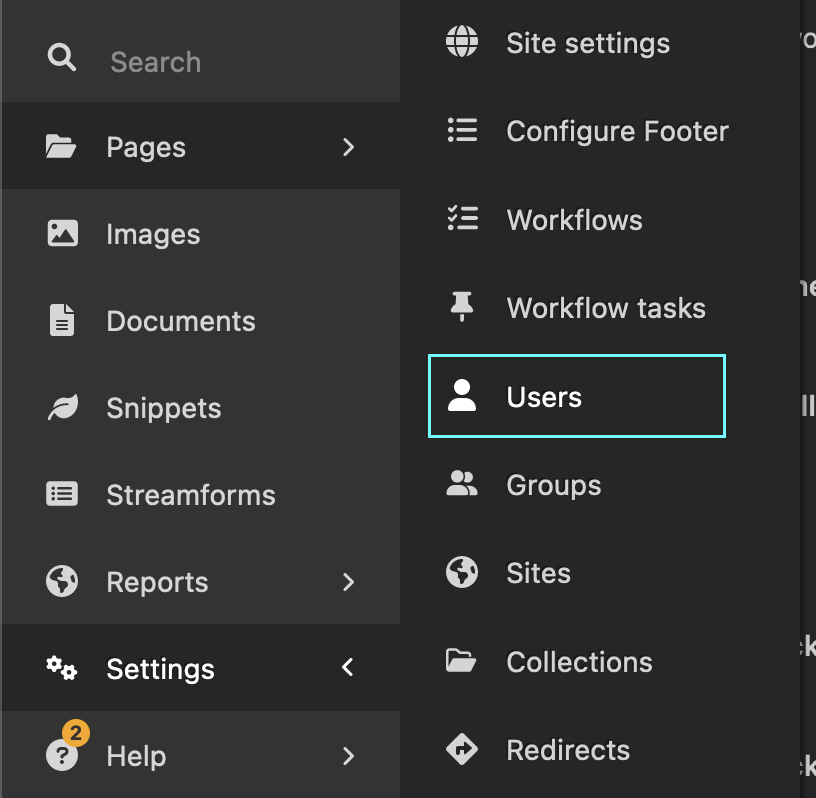

# Adding users to Wagtail

Birdbox has no concept of authenticated public users: all such users are there to access the CMS.

These notes show how to add users with appropriate access to the CMS.

!!! note "User roles"

    Birdbox ships with Wagtail's default Admin, Moderator and Editor roles, but these can be extended/complemented.

    You should have as few full Admin users as possible - ideally just the core developer on the project.

    Only very trusted people should have either an Admin role or have both the Moderator _and_ Editor roles at the same time – these two situations allow an individual to publish content without oversight. Ideally Person A is a Moderator and Person B is an Editor, so they need each other to get content live. See the [Wagtail Editor Guide's notes on roles](https://guide.wagtail.org/en-latest/how-to-guides/manage-users-and-roles/)

1. Get a list of the users to add. You'll need to know their Mozilla SSO email address and which Role(s) they should have - usually Editor or Moderator, and if very trusted, both. Admin roles are reserved for trusted developers and SRE team members.

2. Open a browser and go to `/admin/` on the relevant deployed site URL. You'll see a `Sign in with Mozilla SSO` button - click it to sign in.

3. In Wagtail's settings, find the User section:

{:width="400px"}.

4. Use this to add new Users, again ensuring the username and email match their SSO-linked email address.

5. After entering the core user information, remember to give each user an appropriate role.

6. Hit save.

7. For each of the new users, add them to the appropriate Mozilla SSO auth group(s), so they can actually log in. You do this at `people.mozilla.org/a/GROUP_NAME_HERE`, based on the request you filed with the IAM team. Tip: There'll be a link to each group on your own people.m.o profile if you requested to be an initial curator for the new group(s).
