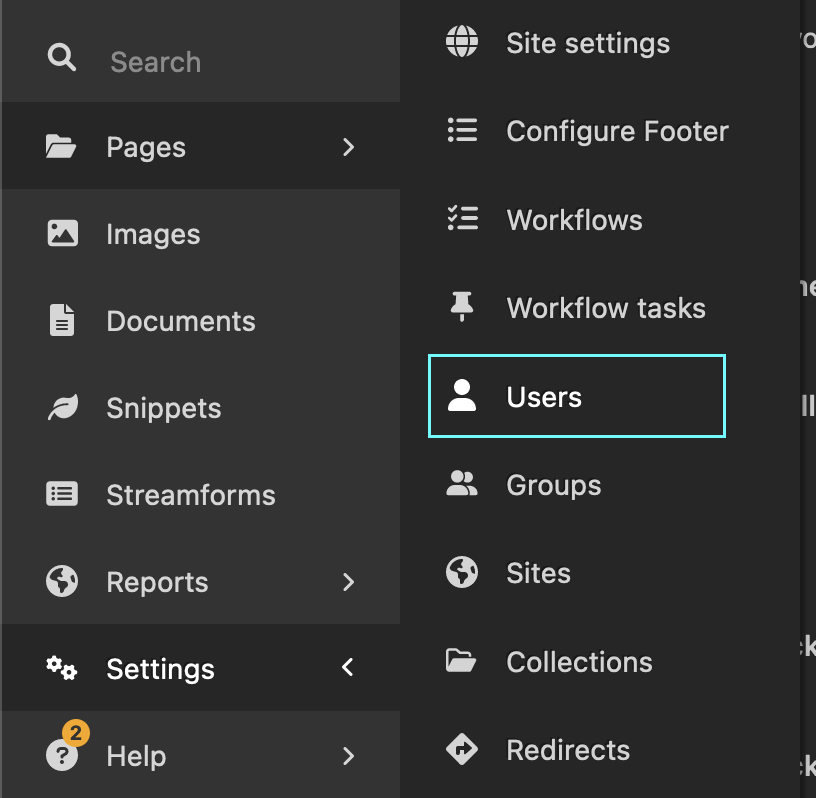

# Setting up a new live site

These are the end-to-end steps required to set up a new site using Birdbox.

## High-level view

The steps are:

1. Fork the core Birdbox repo
2. Set up infrastructure - servers and hostname, plus deployment pipeline
3. Set up/tune site-specific configuration
4. Set up basic/core site ready for content creation
5. Lay in content and QA
6. Go live!

## Codebase

1. Go to <https://github.com/mozmeao/birdbox/> and fork the repo. When naming the forked repo, **do not call it just `birdbox`**, but please prefix it with `birdbox-`. In this documentation we'll use `birdbox-newsite` as our example name.

2. Add appropriate team access to the forked repo, so that colleagues can manage it and you get appropriate alerts: `https://github.com/ORG_NAME/birdbox-newsite/settings/access`

3. Enable Dependabot security updates at `https://github.com/ORG_NAME/birdbox-newsite/settings/security_analysis`

4. Enable GH Actions at `https://github.com/ORG_NAME/birdbox-newsite/actions/`. This is not needed for deployments, but runs workflows like unit tests, for extra protection

5. Protect the `main` branch in the repo at `https://github.com/ORG_NAME/birdbox-newsite/settings/branches`

## Infrastructure setup

The infrastructure we need comprises:

1. A Kubernetes service for each the three environments in Mozilla's standard pattern: `dev`, `stage` and `production`.
2. A deployment pipeline that takes a commit from the application repo and builds a Docker container image from it, and pushes that out to Kubernetes to serve.
3. Domain/hostname setup
4. Monitoring
5. Alerting and error logging

Don't worry, though - as much of this as possible is repeatable, or straightfoward to do.

* The k8s service and deployment pipeline steps (items 1 and 2 above) are well documented by SRE and live in [this internal documentation](https://mozilla-hub.atlassian.net/wiki/spaces/SRE/pages/27919126/Bootstrapping+a+project). At the moment, the majority of this work still needs to be done by a member of the SRE Green team, but as much as possible is already within reach of the MEAO backend team.

* Domain setup (Item 3) has to be handled by SRE.

* Monitoring (item 4) can be set up by a developer or SRE.

* Alerting (Item 5) can be set up by a developer and is mentioned in the [Configuration setup](#configuration-setup) step

!!! note "Key action"

    *Currently, for Steps 1-4, you should request this work via a JIRA ticket*: hit the Create button [here](https://mozilla-hub.atlassian.net/jira/software/c/projects/SE/issues/).

    Use this [template message](sre_template_setup_message.md) to request setup, which makes it clear it is a Birdbox-based project.

    When SRE has set everything up, please add a secure note to the MEAO password vault containing the a) names of the services created e.g. `newsite-dev`, b) the projects they are in and c) the clusters they are running on. You'll need them a lot in the near future.

* Step 5 (Monitoring) can be done as part of the configuration step.

## Configuration

There are a few areas you'll need to configure:

* Application-specific config
* Sentry config
* Slack notifications config
* SSO config

### Application configuration

As part of the infrastructure setup (above), new configuration files will have been added to a private configuration repo owned by Mozilla IT: <https://github.com/mozilla-it/webservices-infra/>

!!! note
    A developer will need appropriate access to the `mozilla-it` organisation.

In that repo you will find a folder for your project - e.g. `birdbox-newsite` or just `newsite`.

In that folder, there will be several configuration files. Most of them you do not need to edit, but the ones related to environment variables may need adding to as part of configuration. Here are the files and example contents for a Birdbox-based project

Each environment will have config specific to it, which must go in a specific file:

* `newsite/k8s/newsite/values-dev.yaml` - config values for the deployed Dev site/service
* `newsite/k8s/newsite/values-stage.yaml` - config values for the deployed Staging site/service
* `newsite/k8s/newsite/values-prod.yaml` - config values for the deployed Production site/service

[Required contents for the env-specific files](./tenant_config_examples/values-env-specific.md).

* `newsite/k8s/newsite/values.yaml` - shared/fallback values if none is specified in one of the above files.

[Required contents for the shared file](./tenant_config_examples/values-excerpt.md).

* `newsite/k8s/newsite/deployment.yaml` - this file specifies config for all deployments, readinging from the relevant `values-*.yaml` file and the`values.yaml` files. If you add a value from `values.*yaml` you should amend the this file, too in order to use it.

!!! note "Don't forget"

    After setup, review the `env:` section of the `deployment.yaml` to be sure that it is definitely pulling in all of the variables set in `values*.yaml` _and that the env var's names exactly match the corresponding names used in `birdbox/settings/base.py` in the main Birdbox codebase_.

### Sentry setup

In the example `values-*.yaml` file above, there is reference to a sentry_dsn and csp_reporting_endpoint. Both of these you can get by setting up a new Sentry project (one for each of dev, stage and prod):

* Sign into Sentry via Mozilla's SSO Dashboard
* Make a new Team at <https://mozilla.sentry.io/settings/teams/> and call it something obvious like the domain of the site you're making (e.g. #future-mozilla-org).
* Add appropriate people to the team - developers and admins currently workign on the project
* For each of Dev, Stage and Prod, make a new project, called something obvious - e.g. `birdbox-newsite-mozilla-org-dev`. Make sure the Team you made has access to each new Project.
* Get the Sentry DSN URI from `https://mozilla.sentry.io/settings/projects/PROJECT_SLUG/keys/`
* Get the Report URI from `https://mozilla.sentry.io/settings/projects/PROJECT_SLUG/security-headers/`

Once you have these two values, you will need to make a PR against <https://github.com/mozilla-it/webservices-infra/> to add them to relevant `values*.yaml` files. This need approval from a member of [CODEOWNERS](https://docs.github.com/en/repositories/managing-your-repositorys-settings-and-features/customizing-your-repository/about-code-owners) before you can merge it.

### Slack notification setup

You can set up deployment notifications in Mozilla Slack. To do this, you'll need to tweak some config in the new deployment repo created by Mozilla SRE - see the documentation above.

**Slack steps:**

1. Make a new, public channel - e.g. `#newsite-notify`
2. Right-click on the channel in the Slack sidebar and `View Channel Details`.
3. From the bottom of that modal, copy the Channel ID.

**Deployment repo steps:**

1. Check out the relevant deployment repo.
2. In the ``.github/workflows/` directory there are YAML files for Dev, Stage and Prod
3. Each of these files has an `env` key called `SLACK_CHANNEL_ID`. It will (likely) be set to a single ID for now - that's SRE's own notification room. You can make the deployment repo send notifications to multiple rooms by switching the value it a comma-separate list of room IDs:

From:

```
SLACK_CHANNEL_ID: FAKE1234567
```

To:

```
SLACK_CHANNEL_ID: "FAKE1234567,FAKE7766554"
```

### SSO setup

!!! note

    The only way to sign in to a deployed Birdbox-based site is via Mozilla SSO.

SSO is managed by the IAM team, and you can request setup via JIRA

* Use this [template message](./template_requests/sso_setup_request_template.md)...
* ...to open an Issue on [this board](https://mozilla-hub.atlassian.net/jira/software/c/projects/IAM/issues)

!!! note "Maintain least privilege"

    The template above has a space to list Mozilla staff who should be the _initial_ curators of a particular access group. [This should be kept as small/tight as possible](https://en.wikipedia.org/wiki/Principle_of_least_privilege). In particular, only give someone access to Production if they absolutely need it to do their job.

    It's always possible add or remove access-group members later on.

Once that request is done, there are three steps left:

1. Get the OIDC credentials into the relevant environments - explained [here](../faqs/#how-do-i-edit-secrets)
2. Create matching users in the Wagtail Admin. See the [specific notes for this](./adding_users_to_wagtail.md)
3. Add users to the appropriate auth group(s) so they can actually log in – you can do this at `people.mozilla.org/a/GROUP_NAME_HERE`. There'll be a link to each group on your own people.m.o profile if you requested to be an initial curator for the new group(s).

!!! note "Don't forget"

    Birdbox does not support automatic user-account creation for someone logging in via SSO, even if they have an @mozilla.com identity - they need to be created first.

    Only users who already exist in the Wagtail admin as a User will be allowed to log in.

## Wagtail: bootstrap an initial site

Now comes the stage where you can start adding pages and content into the site, ahead of go-live.

!!! note "Moving content between sites"

    If you have Dev, Stage and Prod sites and you want them all to have similar content, you'll need to set them all up the same way.

    You can either duplicate the same manual effort across all three, or add content to one of them and then copy it to the other two. That copying process is currently pretty hands-on, but there are [some tips here](../faqs/#how-to-i-copy-data-between-devstageprod-sites).

### Add users

The system starts with no users, and you can't log in to create users unless a matching account already exists. So, first you have to create one via the CLI.

On each deployed environment - dev, stage and prod, do this:

1) Shell into a running pod - [see here if you need help](../faqs/#how-do-i-shell-into-a-running-pod)

2) run `python birdbox/manage.py createsuperuser --email=YOURIDENTITY@mozilla.com --username=YOURIDENTITY@mozilla.com --no-input`. It is crucial that `YOURIDENTITY@mozilla.com` matches your Mozilla SSO email address.

!!! note "No password? No problem"

    The line above will create a new admin user but with no password. Normally in Django that would block authentication until a password it set, but because Mozilla SSO does not need a password (and is the only way to authenticate), this is fine.

3) Now open a browser and go to `/admin/` on the relevant deployed site URL. You'll see a `Sign in with Mozilla SSO` button - click it to sign in.

4) In Wagtail's settings, find the User section:

{:width="400px"}.

5) Use this to add new Users, again ensuring the username and email match their SSO-linked email address.

6) After entering the core user information, remember to give each user an appropriate role.

!!! note "User roles"

    Birdbox ships with Wagtail's default Admin, Moderator and Editor roles, but these can be extended/complemented.

    You should have as few full Admin users as possible - ideally just the core developer on the project.

    Only very trusted people should have either an Admin role or have both the Moderator _and_ Editor roles at the same time – these two situations allow an individual to publish content without oversight. Ideally Person A is a Moderator and Person B is an Editor, so they need each other to get content live. See the [Wagtail Editor Guide's notes on roles](https://guide.wagtail.org/en-latest/how-to-guides/manage-users-and-roles/)

### Set new root page

Wagtail comes pre-set-up with a default "Welcome to your Wagtail site!" page at the site's root of `/`. We need to replace this a new `HomePage`:

1. Go to `/admin/pages/` and click the "Add Child Page" button.
2. The page will be titled "Create a page in Root". Select "Home Page" and add an initial title for the page, plus add something temporary in the Content field such as an Article Block. This will allow you to save the page - use the Publish option from the expanding save button at the bottom of the page.
3. Check you can see your new page listed alongside the Wagtail welcome page. Note how the Wagtail welcome page has a globe icon beside it's name: this indicates it is the root page for the site.
4. From the Wagtail menu go to `Settings > Sites` towards the bottom of the `Settings` sub-menu)
5. If there is one site listed, click it to edit it. If not, click the `Add a site` button.
6. Set the fields appropriately _including changing the root page of the site to the new Home Page you just made_. Mark it as the default site. Save.
7. Go to `/` and you should see your new skeleton homepage instead
8. We no longer need the Welcome page. Go back to `/admin/pages/`, hover over the Welcome page and click the `...` menu. Select `Delete` and delete the page.

### Enable footer and nav

#### Footer

The footer can be manually edited via `Settings > Configure footer`, where links are grouped into columns and the small links are handled as rich text.

If you want to quickly add a Mozilla.org-like footer to a site, you can [shell into a pod](../faqs/#how-do-i-shell-into-a-running-pod) for the relevant environment and run: `python birdbox/manage.py bootstrap_footer --commit`

#### Nav

To enable the navigation bar, go to `Settings > Site settings`. Here's what the options do:

**Show nav bar on site?**
Whether or to have the Nav shown at all

#### Navigation theme

Dark or light theme. Most Mozilla-brand sites use Dark

#### Automatically generate nav from page heirarchy?

If this is enabled, pages that are configured to appear in a Nav will do so, based on the page tree they are part of.

To make a page appear in the nav, go to the `Settings` tab for that page, and tick the `Show in Menus` checkbox then republish the page. There are other navigation-related fields you may want to also populate first.

#### CTA button

If you want a button in the right-side of the nav, this is where you set that up

!!! note
    **After making any changes to Site Settings, remember to Save the settings.**

    The changes are immediately reflected in the site - there is no concept of Preview with Site Settings.

## Wagtail: Lay in content

Build out the tree of pages needed in the site, using the page types available in Birdbox. Each page type has a certain set of components/fields/blocks available, as a form of light 'guard rails' to avoid pages becoming a soup of varied components.

!!! note "Pick appropriate page types"

    There are some that are reserved for certain teams (e.g. pages starting `Innovations*` are for the Innovations team, `ProtocolTestPage` is reserved for core Birdbox testing) but otherwise you can use whatever page types you want.

    In the future, we will [support a way to limit which page types are available](https://github.com/mozmeao/birdbox/issues/213) purely via configuration.

The best way to get familiar with how to add content via Wagtail is to read the official [Editor Guide](https://guide.wagtail.org/en-latest/), which focuses on the CMS editing experience, rather than code. This documentation can also be recommended to the Mozilla colleagues who will be managing content on the site.

## Go live

Once you are sure all of the content on the production site is correct, all that remains is to ask SRE to point the public domain to the same service that is serving the internal production domain.

Things to check before you go live:

* Check the site record (`Settings > Site`) has the correct hostname in it
* Check content for any links to the internal hostname, rather than the public-facing hostname
